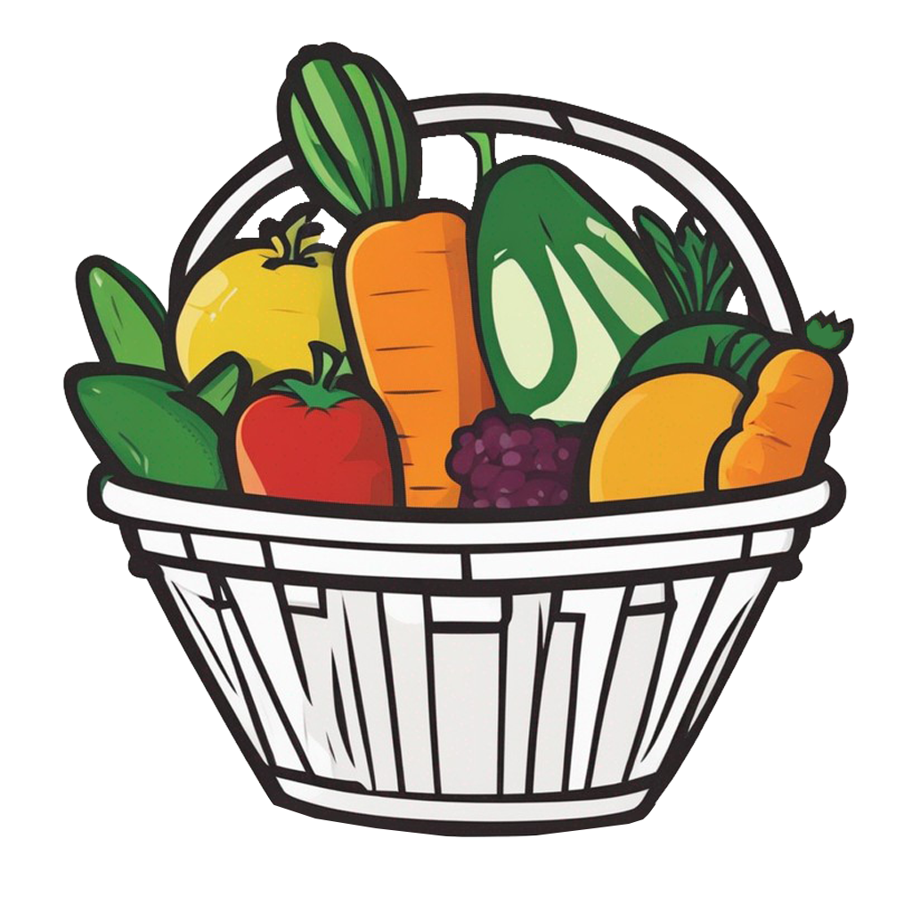

<p align="center">
	
</p>

# Calendrier Fruits et Légumes

Free mobile application to find fruits, vegetables, and cereals that are in season in France.

Note: Data is France-focused. Results are not suitable outside France.

## Features

-   Seasonal calendar view by month
-   List view with search and A–Z sorting
-   Filters: Fruits, Vegetables, Cereals
-   Local preferences saved on device (show/hide filters, sort)
-   Detail pages with description and seasonality per item

## Tech stack

-   Flutter 3 (Dart >= 3.0.5)
-   Packages: shared_preferences, url_launcher, scrollable_positioned_list, linked_scroll_controller, google_fonts, simple_icons
-   Assets: images in `assets/imgs/`, JSON data in `assets/json/`

## Getting started

Prerequisites:

-   Flutter installed and on PATH
-   A device/emulator (Android/iOS) or a desktop/web target enabled

Install dependencies:

```powershell
flutter pub get
```

Run (pick a connected device or target):

```powershell
# Mobile (auto-detects a connected device)
flutter run

# Web
flutter run -d chrome

# Windows desktop (if enabled)
flutter config --enable-windows-desktop; flutter run -d windows
```

## Build

```powershell
# Android APK
flutter build apk --release

# Android App Bundle
flutter build appbundle --release

# iOS (on macOS with Xcode)
flutter build ios --release

# Web
flutter build web --release

# Windows
flutter build windows --release
```

Outputs are generated under `build/`.

## Project structure (partial)

-   `lib/` — Flutter code (pages, components, theme, utils)
    -   `pages/` — Home and detail screens
    -   `components/` — UI widgets (calendar, list, tiles)
    -   `theme.dart` — Color scheme and fonts (Google Fonts Handlee)
-   `assets/json/` — Data files (`months.json`, `fruits.json`)
-   `assets/imgs/` — Product images (fallback provided)
-   `assets/logo/` — App icons and logo

## Data and privacy

-   The app reads static JSON from `assets/json/` and stores simple preferences locally (`shared_preferences`).
-   No tracking, analytics, or external data collection. External links may open your browser (Ko‑fi).

## Contributing

Issues and PRs are welcome. If you add items, update both the JSON data and images, and test calendar and list views.

## License

MIT

## Acknowledgements

-   Product images and data curated for educational use
-   Google Fonts (Handlee)
